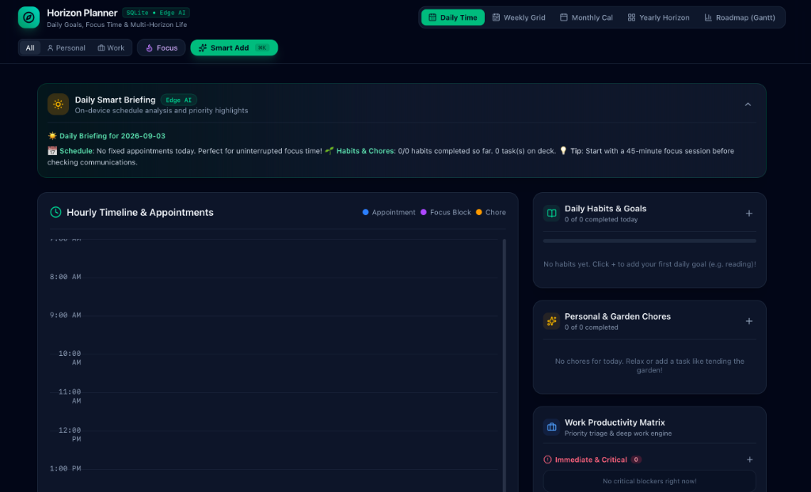

# Horizon Planner (Tasker)

> A modern, cross-platform personal & work productivity ecosystem built with **Tauri 2.0**, **React 19**, **TypeScript**, **Tailwind CSS**, and **SQLite**, supercharged with on-device **Edge AI**.

Designed to bridge long-term vision (**Yearly/Monthly goals**) with ground-level execution (**Daily habits, chores, appointments, and work focus tasks**).

<p align="center">
  
</p>

---

## Key Features

### 1. Daily View with Time & Hourly Schedule
- **24-Hour Vertical Timeline (07:00 – 22:00)**:
  - Real-time live current time indicator line.
  - Visual time-slotted cards for **Appointments** (*Doctor's Appointment at 10:30 AM*), **Focus Blocks** (*2:00 PM Deep Work*), and timed chores.
  - Interactive click-to-schedule directly on any hourly slot.
- **Daily Smart Morning Briefing**:
  - Automatically analyzes today's schedule, urgent items, habits, and appointments on-device to deliver a structured, encouraging morning briefing.
- **Daily Habits & Goals**:
  - Track recurring goals (e.g. *Reading a book 20 pages*, *Morning stretch*).
  - Streak counters with flame badges (🔥), 7-day consistency dots, and celebratory confetti upon completion.
- **Personal & Garden Chores**:
  - Home and living checklist (e.g. *Tend the garden & water plants*).
- **Work Productivity Matrix**:
  - **Immediate / Urgent**: Critical blockers and hotfixes.
  - **Due Today**: Commitments that must wrap up by EOD.
  - **Communication**: Dedicated bucket for Slack messages, client calls, and follow-ups.
  - **Focus Blocks**: Timeboxed deep work with 1-click launch into the Focus Timer.

### 2. Multi-Horizon Calendar Views
- **Weekly Calendar View**:
  - 7-day multi-column time grid (Mon–Sun) with hours on the vertical axis and week navigation.
- **Monthly Calendar View**:
  - 35/42-cell interactive month grid with event chips and a Day Inspector drawer with one-click jump to that day's timeline.
- **Yearly Horizon View**:
  - 12-month calendar heatmap displaying year-round habit consistency and activity density.
  - Quarterly milestones (Q1–Q4) with progress sliders.
  - **Edge AI Goal Decomposition**: Breaks down high-level yearly goals into monthly milestones and daily micro-habits.

### 3. Interactive Gantt-Like Roadmap View (Goals & Long-Running Plans)
- **Visual Timeline Bar Chart**:
  - Goals and long-running multi-day plans are rendered as horizontal bars with start and end dates.
  - Interactive progress fills (0% – 100%) and category color styling.
  - Collapsible hierarchy to view linked child tasks directly beneath parent goals.
- **Adjustable Zoom Levels**:
  - **Weeks**: High-resolution view of weekly milestones.
  - **Months**: Year-at-a-glance monthly layout.
  - **Quarters**: High-level strategic roadmap (Q1 – Q4).
- **Today Indicator Line**:
  - Live vertical marker indicating today's exact position across the timeline.
- **Direct Date Adjustments**:
  - Click on any bar to quickly modify its start or end date, immediately updated in SQLite.

### 4. Built-in Deep Work Focus Timer
- Floating Pomodoro / Focus session modal.
- Presets: **25m Focus**, **50m Deep Work**, **5m Break**, **15m Break**.
- Circular SVG progress countdown, celebration effects, and automatic logging to SQLite `focus_sessions`.

### 5. Edge AI & Natural Language Quick-Capture (`Cmd+K`)
- Private, zero-latency on-device natural language parser:
  - *"Doctor's appointment tomorrow at 10:30am for 45 mins"* &rarr; `APPOINTMENT`, tomorrow, 10:30 AM, 45m.
  - *"Tend the garden at 5pm"* &rarr; `CHORE`, 5:00 PM, 45m.
  - *"Read a book for 20 mins daily"* &rarr; `HABIT`, recurring `DAILY`.
  - *"Immediate: Fix critical checkout bug for client"* &rarr; `TASK`, priority `IMMEDIATE`, scope `WORK`.
  - *"Reply to Sarah about contract"* &rarr; `COMMUNICATION`, scope `WORK`.
- Optional integration with local LLM daemons (Ollama / LM Studio) at `http://localhost:11434/v1`.

### 6. Cross-Platform & Lightweight SQLite Engine
- **Target Platforms**: **Android**, **iOS**, **macOS**, and **Windows** via **Tauri 2.0**.
- **Lightweight Database**: Native **SQLite** via `tauri-plugin-sql`, with in-browser/dev SQLite WASM fallback for rapid web preview.

---

## Tech Stack

- **Desktop & Mobile Runtime**: [Tauri 2.0](https://v2.tauri.app/) (Rust)
- **Frontend Framework**: React 19 + TypeScript + Vite
- **Styling**: Tailwind CSS v4
- **Icons & Effects**: Lucide Icons, Canvas Confetti
- **Date Engine**: date-fns v4
- **Database**: SQLite (`tauri-plugin-sql` + `sql.js` WASM fallback)
- **Testing**: Vitest + React Testing Library (26 passing unit/integration tests)

---

## Getting Started

### Prerequisites
- [Node.js](https://nodejs.org/) (v18+)
- [Rust & Cargo](https://rustup.rs/) (for Tauri desktop/mobile builds)

### Installation

```bash
# Clone the repository
git clone https://github.com/jpferreria/tasker.git
cd tasker

# Install dependencies
npm install
```

### Running Development Server (Web Preview)

```bash
npm run dev
```
Open [http://localhost:1420](http://localhost:1420) in your browser.

### Running Desktop App (Tauri)

```bash
npm run tauri dev
```

### Running Tests

```bash
npm test
```

### Production Build

```bash
npm run build
```

---

## Keyboard Shortcuts

| Shortcut | Action |
|---|---|
| `Cmd + K` / `Ctrl + K` | Smart Quick Capture (Edge AI) |
| `1` | Daily Time Schedule |
| `2` | Weekly Calendar Grid |
| `3` | Monthly Calendar Grid |
| `4` | Yearly Horizon View |
| `5` | Roadmap (Gantt View) |

---

## License

MIT
